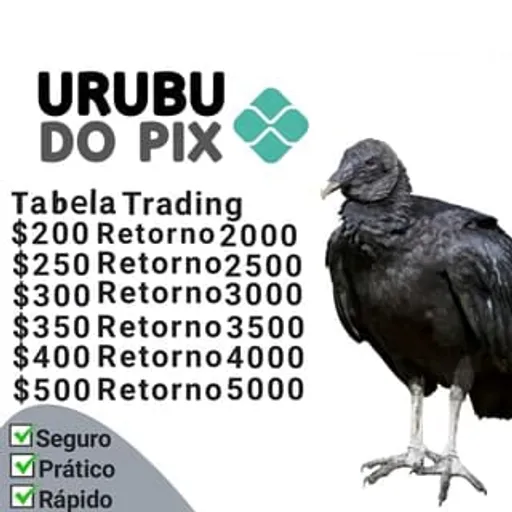

# QRCode do Pix / Urubu do QRCode!

Este é um projeto de final de semana que fiz para gerar QRCodes para recebimento de pagamentos Pix.

## Partes interessantes:

- [`pix.ts`](lib/pix.ts): Arquivo que define a classe `PixField`, a qual é usada para compor o código Pix.
- [`crc16.ts`](lib/crc16.ts): Implementação do algorítimo CRC16 acompanhado da tabela de polinômio `0x1021` e
  inicializado com `0xFFFF`. Esses valores são os valores requeridos pelo Banco Central (BaCen) para se calcular os
  dígitos verificadores do Pix.

## Links e Referências

- Gerador de QRCode: [QRCode-Kotlin](https://qrcodekotlin.com)
- [Documentação do BaCen](https://www.bcb.gov.br/content/estabilidadefinanceira/pix/Regulamento_Pix/II_ManualdePadroesparaIniciacaodoPix.pdf)
- [Shadcn UI](https://ui.shadcn.com/)

## Agradecimentos

Um imenso agradecimento ao mano @jaffrito, que não só deu a ideia como todo o apoio, ajudou a testar e divulgar esse
projeto :)

## Licença

Este código é licenciado via [MIT License](https://rafaellins.mit-license.org/2021/).

## E de onde veio o nome desse repositório? 🤔

É uma brincadeirinha com o famoso meme do Urubu do Pix, compartilhado abundantemente pelo WhatsApp aqui nas Terras
Brasiliensis:

